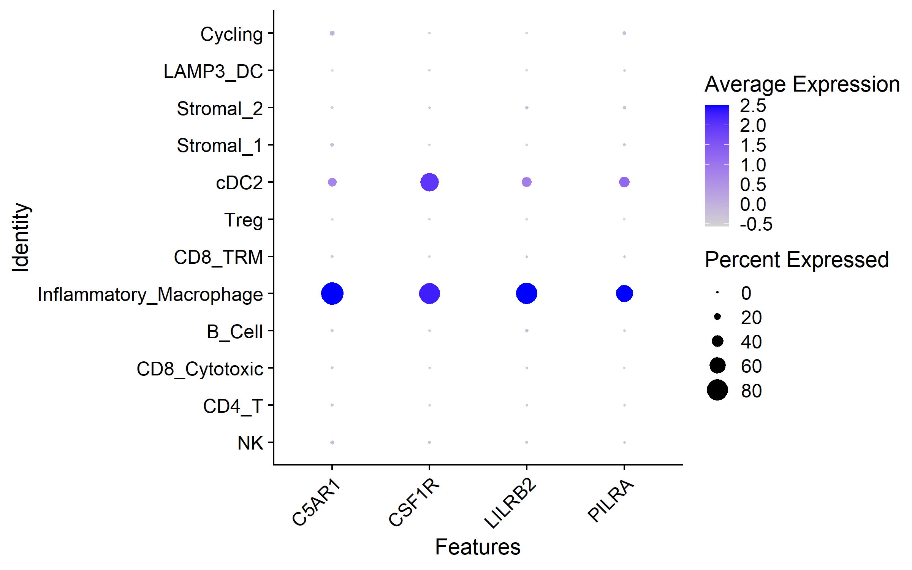

<p align="center">
  
</p>

<h1 align="center">
Cross-Species Therapeutic Target Discovery in Lupus Nephritis
</h1>

<p align="center">


</p>

---

# Overview

This repository presents an end-to-end computational framework for therapeutic target discovery in lupus nephritis through the integration of independent human and mouse transcriptomic datasets.

By combining **human single-cell RNA sequencing**, **cross-species validation**, and **human spatial transcriptomics**, the workflow prioritizes macrophage-associated therapeutic targets supported by multiple orthogonal lines of biological evidence.

The project illustrates how reproducible computational biology can accelerate target discovery and support translational research in autoimmune disease..

---

# Highlights

- Cross-species therapeutic target discovery workflow
- Integration of three independent transcriptomic datasets
- Human, mouse, and spatial validation
- Reproducible end-to-end computational pipeline
- Identification of C5AR1 as the highest-confidence therapeutic target

---

# Scientific Motivation

Inflammatory macrophages play a central role in kidney injury during lupus nephritis.

However, therapeutic target discovery based on a single dataset often identifies candidates with limited reproducibility.

This project addresses this challenge by integrating:

- Human single-cell RNA sequencing
- Mouse single-cell RNA sequencing
- Human spatial transcriptomics
- Cross-species validation
- Spatial validation

to identify robust therapeutic targets consistently associated with inflammatory macrophages across independent datasets and technologies.

---

# Workflow

```text
Human Single-cell RNA Sequencing
             │
             ▼
Inflammatory Macrophage Identification
             │
             ▼
Differential Expression Analysis
             │
             ▼
Cross-Species Validation
(Mouse scRNA-seq)
             │
             ▼
Human Spatial Transcriptomic Validation
             │
             ▼
Final Therapeutic Target Prioritization
```

---

# Repository Structure

```
scripts/
│
├── 01_human_target_discovery.R
├── 02_mouse_validation.R
├── 03_spatial_validation.R
└── 04_final_target_prioritization.R

figures/

results/

docs/

data/
    README.md
```

---

# Datasets

| Dataset | Species | Technology | Purpose |
|----------|----------|------------|----------|
| AMP Lupus Nephritis (SDY997) | Human | Single-cell RNA-seq | Target discovery |
| GSE201932 | Mouse | Single-cell RNA-seq | Cross-species validation |
| GSE263909 | Human | Spatial transcriptomics | Independent validation |

The processed datasets are not included because of GitHub file size limitations.

Instructions for downloading the original public datasets are provided in the **data/** folder.

---

# Computational Pipeline

The workflow integrates multiple layers of biological evidence:

- Quality control and preprocessing
- Cell type annotation
- Identification of inflammatory macrophages
- Differential gene expression analysis
- Cross-species validation using an independent mouse dataset
- Independent validation using human spatial transcriptomics
- Multi-evidence therapeutic target prioritization

This multi-step strategy increases confidence in biologically meaningful therapeutic targets.

---

# Main Results

The computational workflow generated the following outputs:

- Human inflammatory macrophage marker atlas
- Cross-species validation of therapeutic targets
- Independent spatial transcriptomic validation
- Spatial macrophage correlation analysis
- Integrated evidence-based therapeutic target ranking

These analyses consistently prioritized macrophage-associated therapeutic candidates supported by independent biological evidence across datasets and technologies.

---

# Key Findings

The highest-confidence therapeutic targets identified were:

| Rank | Target | Supporting Evidence |
|------|---------|---------------------|
| 1 | C5AR1 | Human scRNA-seq • Mouse scRNA-seq • Spatial validation |
| 2 | LILRB2 | Human scRNA-seq • Spatial validation |
| 3 | CSF1R | Human scRNA-seq • Mouse validation • Spatial correlation |
| 4 | PILRA | Human scRNA-seq • Mouse validation • Spatial correlation |

Among these candidates, **C5AR1** demonstrated the strongest overall evidence, showing:

- strong enrichment in inflammatory macrophages
- reproducible expression across species
- increased expression in lupus nephritis tissue
- positive spatial correlation with macrophage-rich regions

These findings support C5AR1 as a promising therapeutic candidate for further functional investigation.

---

# Biological Significance

The integrated analysis suggests that inflammatory macrophages in lupus nephritis are characterized by coordinated activation of:

- Complement signaling
- Myeloid activation pathways
- Innate immune receptors
- Macrophage differentiation programs

These pathways represent potential opportunities for therapeutic intervention.

---

# Example Figures

## Human Inflammatory Macrophage Discovery

<p align="center">

</p>

---

## Cross-Species Validation

<p align="center">

</p>

---

## Integrated evidence-based therapeutic target ranking

<p align="center">

</p>

---

# Technologies

- R
- Seurat
- GEOquery
- dplyr
- ggplot2
- clusterProfiler
- Single-cell RNA sequencing
- Spatial transcriptomics
- Computational Immunology
- Translational Target Discovery

---

# Limitations

Several limitations should be considered:

- Mouse and human immune systems are not identical, limiting complete cross-species translation.
- Spatial transcriptomic regions contain mixed cellular populations rather than isolated macrophages.
- Target prioritization is based on transcriptomic evidence and does not establish functional causality.
- Independent validation in additional lupus nephritis cohorts would further strengthen confidence.

Despite these limitations, convergence across independent datasets substantially increases confidence in the identified therapeutic candidates.

---

# Future Directions

Planned extensions include:

- Cell–cell communication analysis
- AI-driven therapeutic target prioritization
- Multi-omic target integration
- GWAS integration
- Druggability annotation
- Functional validation using experimental models

---

# Reproducibility

The analysis is fully reproducible.

Run the scripts in order:

```
01_human_target_discovery.R

↓

02_mouse_validation.R

↓

03_spatial_validation.R

↓

04_final_target_prioritization.R
```

All intermediate tables and publication-quality figures are generated automatically.

---

# Related Projects

This repository is part of the **[AI Computational Immunology Portfolio](https://github.com/hlancia/AI-Computational-Immunology-Portfolio/tree/main)**.

- Cross-Species Therapeutic Target Discovery in Lupus Nephritis
- Cell–Cell Communication Analysis in Lupus Nephritis
- AI-Driven Therapeutic Target Prioritization
- AI-Driven Patient Stratification and Precision Targeting

Together, these repositories demonstrate a complete computational workflow progressing from **single-cell target discovery** to **AI-assisted precision medicine**.

---

# Author

Independent computational biology and AI project focused on:

- Translational Immunology
- Autoimmune Disease
- Single-cell Transcriptomics
- Therapeutic Target Discovery
- Machine Learning
- Precision Medicine
